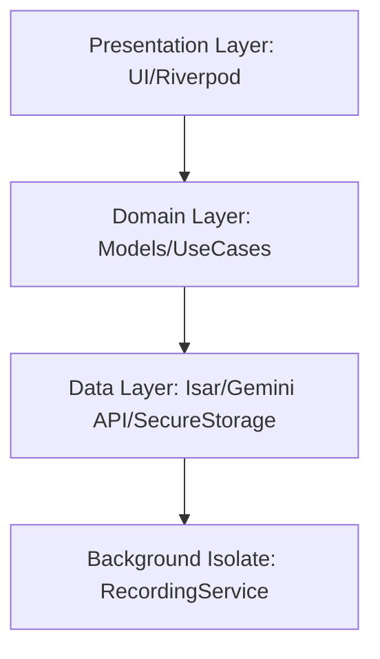

# EchoScript: Enterprise Audio Intelligence

**Version:** 1.0.1+12  
**Philosophy:** Zero-Failure, Mission-Critical Intelligence.

EchoScript is a professional-grade background audio capture and concurrent AI transcription engine. Designed for 24/7 reliability, it leverages Google's Gemini Pro architecture to turn ambient audio into searchable, actionable intelligence.

## 🏛️ Project Governance
- **Author/Project Lead:** [Zihad Hasan](https://github.com/zihaaaad)
- **Organization:** As-Sunnah Foundation AI Team

## 🛡️ Enterprise Pillars

### 1. Zero-Gap Audio Capture
EchoScript uses a dual-sink rotation engine. It swaps file buffers without stopping the hardware recorder, ensuring 100% gapless continuous capture during long-running sessions. Users can define rotation intervals (1–60 minutes) in the Control Center.

### 2. SRE-Hardened Intelligence Pipeline
*   **Zero-Heap Streaming:** Audio is streamed directly to the Gemini Files API via multipart uploads, maintaining a flat memory profile even for massive recordings.
*   **Resilient Queueing:** An Isar-based persistent queue handles network outages with exponential backoff retries (429/503 handling).
*   **Background Integrity:** Optimized background isolates with WakelockPlus ensure 24/7 persistence even under aggressive Android battery saving.

### 3. Strategic Clarity UI (2026 Standard)
A high-contrast "OLED Black" (Slate 950) interface. Features a Bento-grid dashboard and a real-time word-tokenized search archive for sub-millisecond keyword retrieval.

## 🛠️ System Architecture (Clean Architecture / MVVM)

## 🚀 Setup & Deployment

1.  **API Integration:** Obtain a Gemini API Key and securely store it in the **Control Center**.
2.  **Permissions:** Grant Microphone and Notification permissions. Exempt the app from **Battery Optimization** for 24/7 reliability.
3.  **Deploy:** Press the **Initiate Capture** node to begin the intelligence protocol.

## 🔒 Security & Privacy
- **Local-First Storage:** All audio chunks reside in `getTemporaryDirectory()` to bypass cloud backup syncing.
- **24-Hour Purge:** Audio data is automatically purged from the device after successful AI transcription.
- **Encryption:** API keys are stored in encrypted OS-level storage (FlutterSecureStorage).

---
*Enterprise intelligence, delivered without compromise. Copyright (c) 2026 Zihad Hasan.*
